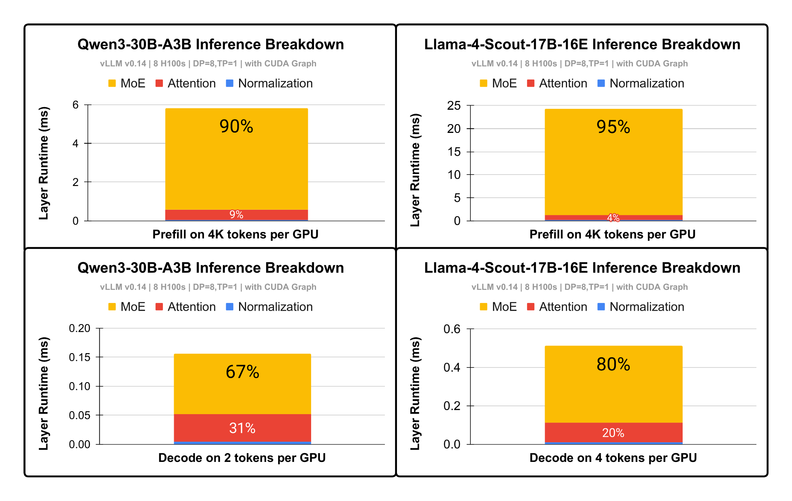
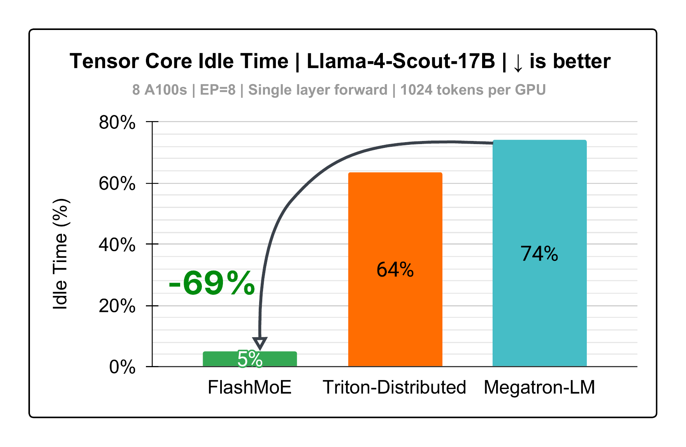
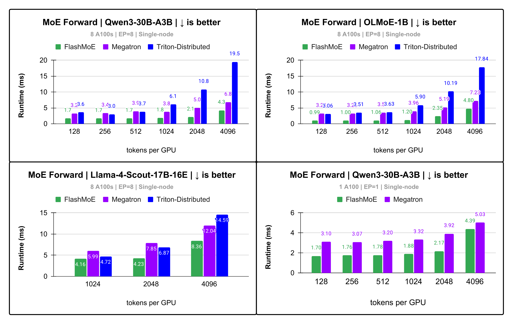
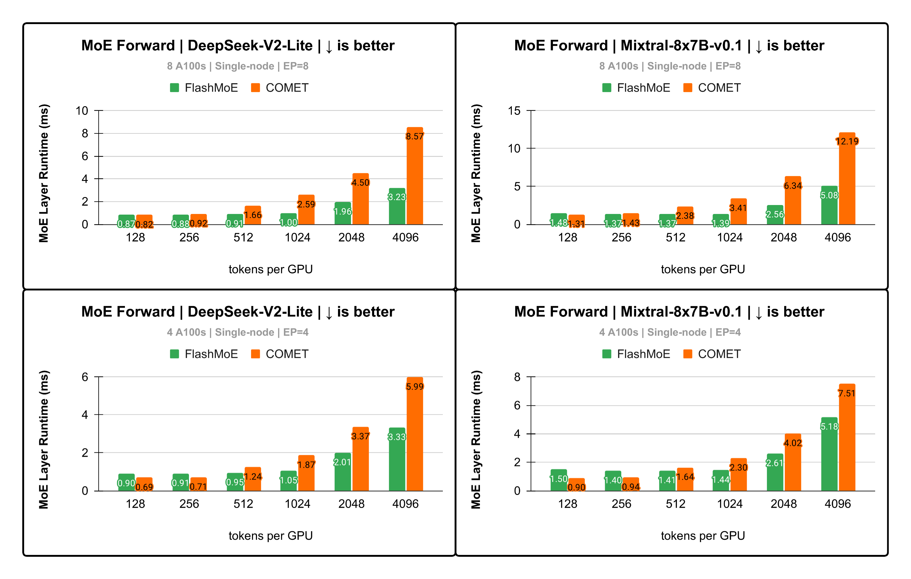
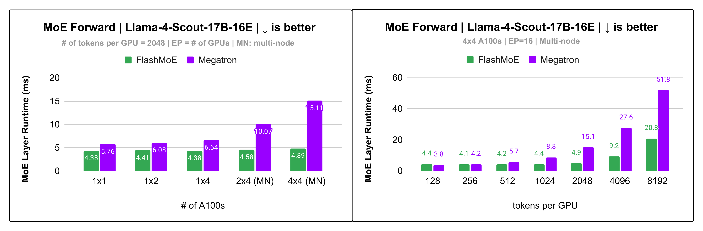
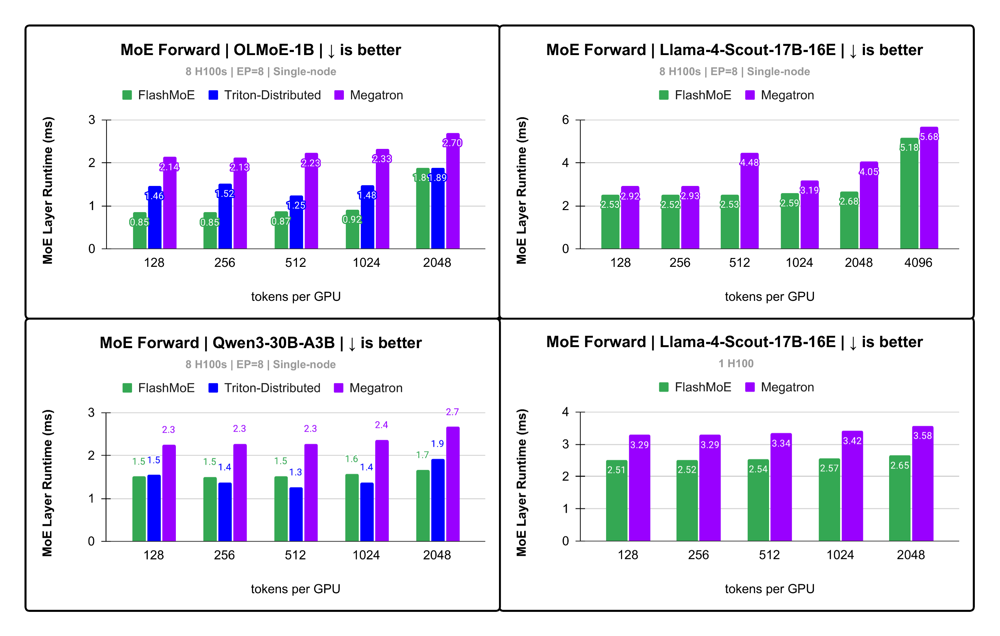

# FlashMoE: Fast Distributed MoE in a Single Kernel [NeurIPS'25]

A Completely fused distributed MoE kernel providing high-performance single- and multi-node EP inference 
and compatible with CUDA graphs. See paper [here](https://arxiv.org/abs/2506.04667).
## Problem: MoE Bottlenecks in Inference
<div align="center">
  
    <p><em>Figure 1: Opportunity. MoE constitutes 67%-95% of inference runtime</em></p>
</div>

---

This text will wrap around the image on the left side. Useful for clean layouts in documentation.

## Our Solution

Distributed MoE is notorious for 

**FlashMoE** is a high-throughput, fast and portable GPU kernel that fuses the following **Distributed Mixture-of-Experts (DMoE)** operations:
- MoE Dispatch
- Expert computation (Gated MLP or conventional MLP)
- MoE Combine

into a *single, tile-pipelined, persistent kernel*.

It is written from scratch entirely in **pure CUDA C++**, leaning heavily on 
[cuBLASDx](https://docs.nvidia.com/cuda/cublasdx/) and [NVSHMEM](https://developer.nvidia.com/nvshmem), 
for compute and communication, respectively.

### 🏎️ Portability

we support 
- $\geq$ SM70 GPUs. Boosting compute performance for Hopper and Blackwell is on the roadmap.
- NVLink and multi-node RDMA (EFA, IBGDA, libfabric as NVSHMEM [supports](https://docs.nvidia.com/nvshmem/release-notes-install-guide/install-guide/abstract.html#hardware-requirements)).
- FP16, BF16, FP32 (TF32), FP64.
---

## Requirements
- CUDA toolkit
- C++20
- ninja (`sudo apt install ninja-build`)
- CMake (>= 3.28)

### Hardware Requirements
- GPU Architecture $\geq$ SM 70. 
- A P2P GPU interconnect (NVLink, some PCIe and GPUDirect RDMA). NVSHMEM will fail if this criterion is not met.

## Installation
### Install cuBLASDx
- Download from [here](https://developer.nvidia.com/cublasdx-downloads) and save in `<your_directory>`, e.g `~/.local`.
- export `MATHDX_ROOT=<your_directory>/nvidia-<...>/mathdx/yy.mm/`

### Install NVSHMEM
- Install as directed [here](https://developer.nvidia.com/nvshmem-downloads).
- export `NVSHMEM_LIB_HOME=/usr/lib/x86_64-linux-gnu/nvshmem/<12 or 13>`. Do confirm this directory exists!

> 👉 Tip: add `MATHDX_ROOT=...` and `NVSHMEM_LIB_HOME=...` to `.bashrc`

## 🚀 Python QuickStart
```bash
pip install flashmoe[cu12] # or cu13
```
## Using Python API
```python
# quick.py
import argparse
import cuda.core.experimental as cuda
import flashmoe
import torch

device_id = flashmoe.get_local_rank()
dev = cuda.Device(device_id)
dev.set_current()
stream = dev.create_stream()
stream_ptr = int(stream.handle)
arch = int(dev.arch) * 10
    
if __name__ == "__main__":
    parser = argparse.ArgumentParser()
    parser.add_argument("--torch-init", action="store_true")
    args = parser.parse_args()
    
    if args.torch_init:
        import torch.distributed as dist, os
        assert os.environ.get("LOCAL_RANK") is not None, "need to launch with torchrun if set with torch_init=True"
        world_size = os.environ.get("WORLD")
        local_rank = int(os.environ['LOCAL_RANK'])
        torch.cuda.set_device(local_rank)
        device = torch.device("cuda", local_rank)
        dist.init_process_group(
            backend="cpu:gloo,cuda:nccl",
            rank=os.environ.get("RANK"),
            world_size=world_size,
            device_id=device
        )
        
    # Llama4-Scout-17B-16E shapes
    tokens_per_rank = 1024
    token_dim = 5120
    ffn_size = 8192
    num_experts = 16
    k = 1
    
    # define model config
    mlp_type = flashmoe.MLPType.GATED # Gated MLP
    data_type = flashmoe.DataType.BF16
    act_type = flashmoe.ActivationType.SILU
    
    init_args = flashmoe.InitArgs(data_type=data_type,
        mlp_type=mlp_type, act_type=act_type,
        tokens_per_rank=tokens_per_rank, token_dim=token_dim,
        ffn_size=ffn_size, num_experts=num_experts,
        top_k=k, gpu_arch=arch, stream_ptr=stream_ptr, device_id=device_id)
    
    # initialize flashmoe and fused router
    flash_handle = flashmoe.initialize(init_args)
    router_handle = flashmoe.router.initialize(init_args)

    # call forward of fused router
    router_forward_args = ... # see quickstart.py for an example
    flashmoe.router.forward(router_handle, flash_handle, router_forward_args)
    # call forward of FlashMoE
    flashmoe_forward_args = ... # see quickstart.py for an example
    flashmoe.forward(flash_handle, flashmoe_forward_args) # single kernel for Dispatch + Experts + Combine
    
    # call finalize
    flashmoe.finalize(flash_handle, stream_ptr)
    flashmoe.router.finalize(router_handle, stream_ptr)
    stream.close()
    if args.torch_init:
        import torch.distributed as dist
        dist.destroy_process_group()
```
### Running the Python Program
With torchrun:
```shell
torchrun --nproc_per_node=<number of GPUs> quick.py --torch-init
```
With MPI:
```shell
mpiexec -n <number of GPUs> python3 quick.py
```

## Use C++ API (header-only)
Add the following to your `CMakeLists.txt`
```CMake
CPMAddPackage(
  NAME flashmoe
  GITHUB_REPOSITORY osayamenja/flashmoe
  GIT_TAG main
)

target_link_libraries(app PRIVATE flashmoe::flashmoe)

FlashMoESetRDC(app)
FlashMoEAddOptions(app)
```
and include the header file like below. See `csrc/tests/flashmoe.cu` for more usage details.
```cpp
#include <flashmoe/flashmoe.cuh>
```
---

### ✅ Roadmap
- [ ] Improve MMA for Hopper (WGMMA) and Blackwell (UTCMMA).
- [ ] FP8 support
- [ ] Shared experts
- [ ] AMD support

---

## 📊 Performance Results
- We measure with the EP+DP parallelism scheme.
- We compare against [COMET](https://github.com/bytedance/flux) (MLSys '25), [Megatron-LM](https://github.com/NVIDIA/Megatron-LM), and 
[Triton-Distributed](https://github.com/ByteDance-Seed/Triton-distributed). 
- We measure a single layer's execution only. 
- For every model we evaluated, 
we use model shapes and data types as defined in its corresponding `config.json` on HuggingFace. 
- We **do not** execute any shared experts.
> 👉 On frontier MoE models, FlashMoE gives up to 5x lower runtime and 69% increase in tensor core utilization compared to SOTA baselines.

## Tensor Core Utilization
<div align="center">
  
<p><em>Figure 2: Up to 5.1x faster MoE layer runtime on Qwen-30B with single-node EP</em></p>
</div>

---

## Gated MLP

<div align="center">
  
<p><em>Figure 3: Up to 5.1x faster MoE layer runtime on Qwen-30B with single-node EP</em></p>
</div>

---

## Conventional MLP
<div align="center">
  
<p><em>Figure 4: Up to 2.6x faster runtime DeepSeek-V2-Lite</em></p>
</div>

---

## Multi-node (libfabric on Slingshot 11)
<div align="center">
  
<p><em>Figure 5: Up to 3x speedup on Llama4-Scout for multi-node EP!</em></p>
</div>

--- 

## H100s
<div align="center">
  
<p><em>Figure 6: Up to 2.5x speedup on H100s.</em></p>
</div>

---

## Run Benchmark (C++)
```shell
cd csrc
mkdir cmake-build-release && cd cmake-build-release
cmake -DCMAKE_BUILD_TYPE=Release -Wno-dev -G Ninja -S.. -B.
cmake --build . --target testFlashMoE --parallel
export NVSHMEM_BOOTSTRAP=MPI
mpirun -n <world> ./testFlashMoE <num tokens per rank> <token dim> <ffn dim> <num experts total> <top k>
```


## IDEs
The codebase integrates well with CLion: open the project at `csrc`.

---

## Contributions
We welcome them! Submit a PR!

# 📖 Citation
If you can, please cite as below:
```
@misc{aimuyo2025flashmoe,
      title={FlashMoE: Fast Distributed MoE in a Single Kernel}, 
      author={Osayamen Jonathan Aimuyo and Byungsoo Oh and Rachee Singh},
      year={2025},
      eprint={2506.04667},
      archivePrefix={arXiv},
      primaryClass={cs.DC},
      url={https://arxiv.org/abs/2506.04667}, 
}
```
